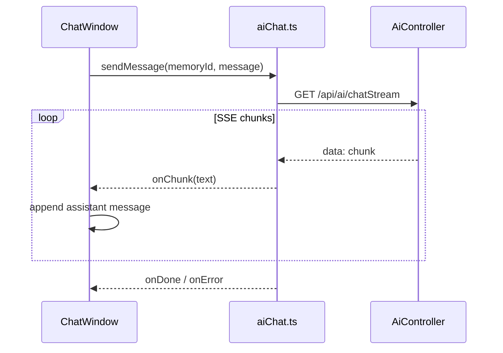

# Vue 3 流式聊天前端对接方案

## 背景与接口契约

后端已实现流式对话接口（[AiController.java](D:/files/own/code/SpringAiLearn/ai-code-helper/src/main/java/com/tp/springai/aicodehelper/controller/AiController.java)）：

- **方法**: `GET`
- **路径**: `/api/ai/chatStream`（完整地址 `http://localhost:8081/api/ai/chatStream`）
- **参数**: `memoryId`（int，会话 ID）、`message`（string，用户消息）
- **响应**: `text/event-stream`，每条事件 `data` 为文本 chunk

后端按 `memoryId` 隔离会话记忆（每会话最多 10 条，见 [AiCodeHelperServiceFactory.java](D:/files/own/code/SpringAiLearn/ai-code-helper/src/main/java/com/tp/springai/aicodehelper/ai/AiCodeHelperServiceFactory.java)）。AI 定位为编程学习/求职助手（见 [system-prompt.txt](D:/files/own/code/SpringAiLearn/ai-code-helper/src/main/resources/system-prompt.txt)）。

当前前端工作区 [ai-code-helper-frontend](D:/files/own/code/SpringAiLearn/ai-code-helper/ai-code-helper-frontend) **为空目录**，需从零搭建。




## 技术选型


| 项      | 选择                              | 理由                                                     |
| ------ | ------------------------------- | ------------------------------------------------------ |
| 框架     | Vue 3 + Composition API         | 用户指定                                                   |
| 构建     | Vite + TypeScript               | 与 Vue 3 生态匹配                                           |
| SSE 消费 | `fetch` + `ReadableStream` 手动解析 | 支持 `AbortController` 停止生成；比原生 `EventSource` 更易处理错误与长消息 |
| 样式     | 组件内 scoped CSS                  | 范围最小，不引入 UI 库                                          |
| 跨域     | Vite dev proxy                  | 开发期规避 CORS；生产需后端 CORS 或同域部署                            |


**不采用** `@microsoft/fetch-event-source`：单接口、GET 请求，手写 SSE 解析足够且零额外依赖。

## 项目结构

```
ai-code-helper-frontend/
├── index.html
├── package.json
├── vite.config.ts              # dev proxy → localhost:8081
├── tsconfig.json / env.d.ts
├── .env.development            # VITE_API_BASE=/api
└── src/
    ├── main.ts
    ├── App.vue
    ├── types/chat.ts           # Message, Role 类型
    ├── utils/memoryId.ts       # 生成/持久化 memoryId
    ├── api/aiChat.ts           # chatStream() SSE 封装
    ├── composables/useChatStream.ts  # 消息状态、发送、停止
    └── components/
        ├── ChatWindow.vue      # 主布局
        ├── MessageList.vue     # 消息列表 + 流式光标
        └── ChatInput.vue       # 输入框 + 发送/停止
```

## 核心实现要点

### 1. 初始化脚手架

在 `ai-code-helper-frontend` 执行：

```bash
npm create vite@latest . -- --template vue-ts
npm install
```

### 2. 开发代理与 Base URL

[vite.config.ts](D:/files/own/code/SpringAiLearn/ai-code-helper/ai-code-helper-frontend/vite.config.ts) 配置：

```ts
server: {
  proxy: {
    '/api': { target: 'http://localhost:8081', changeOrigin: true }
  }
}
```

`.env.development`：`VITE_API_BASE=/api`，前端统一用 `${import.meta.env.VITE_API_BASE}/ai/chatStream`。

### 3. SSE API 层 (`src/api/aiChat.ts`)

- 构建 URL：`new URL(..., window.location.origin)` + `searchParams` 设置 `memoryId`、`message`（自动 URL 编码）
- `fetch(url, { signal })` 获取响应体
- 用 `TextDecoder` 逐块读取，按 SSE 规范解析 `data:` 行（以 `\n\n` 分隔事件）
- 回调：`onChunk(text)`、`onDone()`、`onError(err)`
- 非 2xx 响应读取 body 后抛错

### 4. 会话 ID (`src/utils/memoryId.ts`)

- 首次访问：`localStorage` 生成随机正整数 `memoryId`
- 「新对话」按钮：重新生成并清空消息列表
- 同一会话内保持同一 `memoryId`，与后端记忆对齐

### 5. 状态管理 (`src/composables/useChatStream.ts`)

```ts
// 核心状态
messages: Ref<Message[]>   // { id, role: 'user'|'assistant', content, streaming? }
isStreaming: Ref<boolean>
error: Ref<string | null>
abortController: AbortController | null
```

**发送流程**：

1. 追加 user 消息
2. 追加空 assistant 消息（`streaming: true`）
3. 调用 `chatStream`，每个 chunk 追加到最后一条 assistant
4. 完成或出错后设 `streaming: false`；出错时展示错误文案
5. 「停止」调用 `abortController.abort()`

### 6. 聊天 UI

- **ChatWindow**：标题「AI 编程助手」、新对话、消息区、输入区
- **MessageList**：左右气泡区分 user/assistant；流式时末尾显示闪烁光标
- **ChatInput**：Enter 发送、Shift+Enter 换行；流式中禁用输入、显示「停止」按钮
- 新消息自动滚动到底部（`scrollIntoView`）

UI 风格：浅色背景、圆角气泡、居中窄栏（约 800px），贴合编程助手场景，无需 Markdown 渲染（首版纯文本即可）。

## 后端注意事项（建议同步修复）

[CorsConfig.java](D:/files/own/code/SpringAiLearn/ai-code-helper/src/main/java/com/tp/springai/aicodehelper/config/CorsConfig.java) **缺少 `@Configuration` 注解**，Bean 未注册，生产或非 proxy 场景会跨域失败。建议在实施前端时顺手补上：

```java
@Configuration
public class CorsConfig implements WebMvcConfigurer { ... }
```

开发期靠 Vite proxy 可正常工作，不阻塞前端开发。

## 验证步骤

1. 启动后端：`cd ai-code-helper && mvn spring-boot:run`（端口 8081，需配置 `OPENAI_API_KEY` 等环境变量）
2. 启动前端：`cd ai-code-helper-frontend && npm run dev`
3. 浏览器打开 Vite 地址，发送「如何学习 Java？」
4. 确认 assistant 回复逐字流式出现
5. 连续追问，验证同 `memoryId` 下有上下文
6. 点击「新对话」，验证 memoryId 变更、历史清空
7. 流式过程中点「停止」，确认请求中断且 UI 恢复可输入
8. 发送含敏感词（如 "kill"）的消息，验证 guardrail 错误能展示（[SafeInputGuardrail.java](D:/files/own/code/SpringAiLearn/ai-code-helper/src/main/java/com/tp/springai/aicodehelper/ai/guardrail/SafeInputGuardrail.java)）

## 范围边界（首版不做）

- Markdown / 代码高亮渲染
- 多会话列表与历史持久化
- 用户登录、鉴权
- 非流式 fallback 接口
- 单元测试 / E2E（可按需后续补充）

